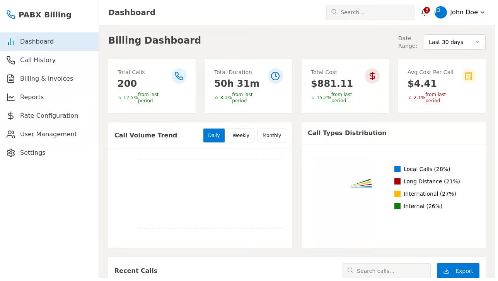

# PABX Billing System

A comprehensive Private Automatic Branch Exchange (PABX) billing system designed to track calls, calculate costs, and generate invoices for organizations. This system helps businesses monitor and manage their telephony expenses efficiently.

<video width="600" controls>
  <source src="1.mp4" type="video/mp4">
  Your browser does not support the video tag.
</video>

## Features

- Dashboard with call volume trends, call type distribution, and summary statistics
- Call history with filtering and sorting capabilities
- Billing management for generating and tracking invoices
- Rate configuration for different call types
- User and department management
- Customizable reports generation

## Technology Stack

- Frontend: React with Vite, TailwindCSS, and Shadcn UI components
- Backend: Node.js with Express
- In-memory storage (can be extended to use PostgreSQL)
- Zod schema validation
- React Query for server state management
- React Hook Form for form handling

habizinnia@gmail.com
